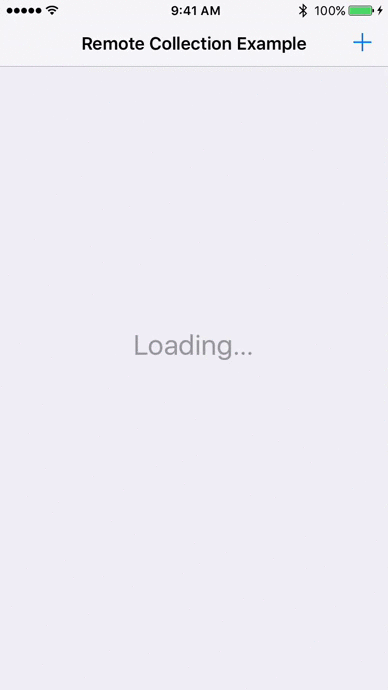

# OriginateRemoteCollection
[](https://travis-ci.org/Originate/OriginateRemoteCollection)

> A (high level) class modeling a remotly retrieved collection of data.

<div align="center">
    
</div>

# Installation with CocoaPods
Add the following lines to your Podfile and run `pod install`.

```ruby
source 'https://github.com/Originate/CocoaPods.git'
pod 'OriginateRemoteCollection'
```

# Requirements
- iOS 8.0+

# Usage

For a detailed example please consult the example project. The files you want to pay attention to are:
* `MyViewController` - Wires everything up.
* `MyDataSource` - Inherits from `OriginateRemoteCollection` and implements `UITableViewDataSource` and `UITableViewDelegate`. Reacts to data changes and dispatches reload requests to the associated table view.
* `MyEmptyController` - Provides the content for DZNEmptyDataSet.

## Import the Framework

Add the following line wherever you want to access the framework:
```objective-c
@import OriginateRemoteCollection;
```

## High Level Intro

The aim of this class is to provide a "lazy collection" destined to be used as a form of data source for controllers.

For maximum profit it is recommended to subclass `OriginateRemoteCollection` and extend it with more specific behavior that your controller requires (like for instance, implementing `UITableViewDataSource`...).

# License
OriginateRemoteCollection is available under the MIT license. See the LICENSE file for more info.
